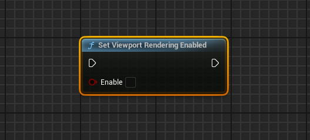

# Disable Viewport Rendering Plugin

> Simple unreal plugin that exposes an engine function to blueprints to disable the rendering of the viewport.

### Why would I want this?

Useful for when you want to render the scene using a `SceneCapture2D` to a `RenderTexture` which is then being sent in real-time to another software using a protocol like [NDI](https://ndi.video/), [Spout](https://spout.zeal.co/) or [Texture Share](https://docs.unrealengine.com/5.0/en-US/texture-share-in-unreal-engine/).

You can see an improvement in performance of around 20% by disabling the viewport rendering.

### How to use?

I included a `BP_DisableEditorRendering` blueprint in the plugin's content folder that uses the function for the aforementioned use case. Drag that blueprint to your scene and set the properties in the Details Panel to your liking.

### How does it work?

It sets the `bDisableWorldRendering` property of the `UGameViewportClient`. [More information](https://docs.unrealengine.com/4.27/en-US/API/Runtime/Engine/Engine/UGameViewportClient/).

This also stops the rendering of `SceneCapture2D` components, but you can manually call CaptureScene() every frame to get them to render anyway. `BP_DisableEditorRendering` does this automatically.

Tested on Unreal 5.3.2
